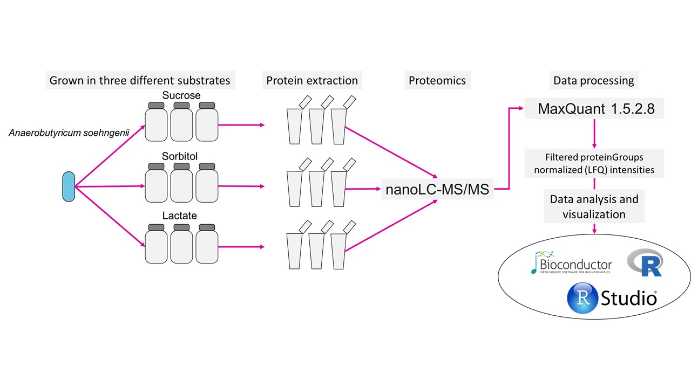
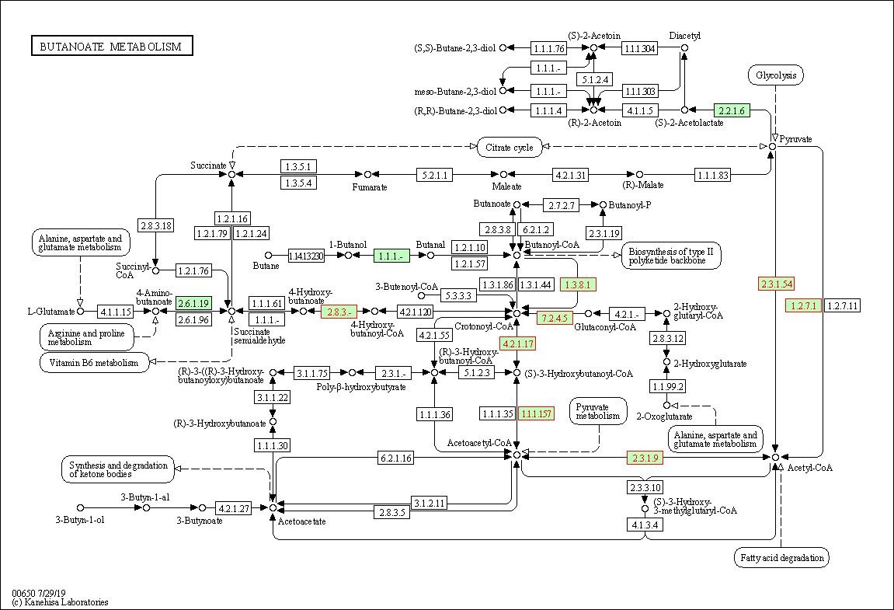

# Introduction  
This tutorial is focused towards analysing microbial proteomics data. Most of the analysis is done using the `DEP` R package created by [Arne Smits and Wolfgang Huber](https://bioconductor.org/packages/devel/bioc/vignettes/DEP/inst/doc/DEP.html]). 
Reference: [Zhang X, Smits A, van Tilburg G, Ovaa H, Huber W, Vermeulen M (2018). “Proteome-wide identification of ubiquitin interactions using UbIA-MS.” Nature Protocols, 13, 530–550.](https://www.nature.com/articles/nprot.2017.147).  

The data structure used by DEP is [SummarizedExperiment](https://bioconductor.org/packages/release/bioc/html/SummarizedExperiment.html).  

The data used in this tutorial is from [Shetty, S.A., Boeren, S., Bui, T.P.N., Smidt, H. and De Vos, W.M., 2020. Unravelling lactate-acetate conversion to butyrate by intestinal Anaerobutyricum and Anaerostipes species. bioRxiv.](https://www.biorxiv.org/content/10.1101/2020.06.09.139246v1.full)  
[Source for this tutorial] https://github.com/microsud/Bacterial-Proteomics-in-R


**The overview of experiment:  **  
```{r pressure, echo=FALSE, out.width = '75%'}

```

We will ain to identify key proteins that are invovled on utilization of `lactate`, `sorbitol` and `sucrose`.   

# Initiation    
## Installing packages
```{r eval=FALSE}
#https://bioconductor.org/packages/devel/bioc/vignettes/DEP/inst/doc/DEP.html
#http://bioconductor.org/packages/release/bioc/vignettes/MSnbase/inst/doc/MSnbase-demo.html

.cran_packages <- c("ggplot2", "patchwork", "dplyr", "ggpubr", "devtools","pheatmap")
.bioc_packages <- c("SummarizedExperiment", "DEP")
.inst <- .cran_packages %in% installed.packages()
if(any(!.inst)) {
  install.packages(.cran_packages[!.inst])
}
if (!requireNamespace("BiocManager", quietly = TRUE))
  install.packages("BiocManager")
BiocManager::install(.bioc_packages)

```

**Load libraries**

```{r, message=FALSE, warning=FALSE}

library("DEP")
library("ggplot2")
library("dplyr")
library("pheatmap")
library("SummarizedExperiment")
library("ggpubr")
library("patchwork")

```

Load the data recieved from MaxQuant.  

## Import data  

### Peptide/Proteins intensities  

```{r}

data <- read.csv("three_carbon.csv", 
                 header = T, 
                 row.names = 1)

```

Check what this files consists.  
```{r}
head(data)[1:5] # this will list first 5 rows and all columns
```
Check which columns do we have in this dataset.  
```{r}
colnames(data)
```

We have 121 columns. These consists of a variaty of information.  

### Import sample information  

**Note:** Important to have column called `Condition`  
```{r}
# Read sample information
sam_dat <- read.csv("sample_data_carbon.csv", header = T,
                    row.names = 1, check.names = F)
rownames(sam_dat)

```

Process the sample data to add three columns, `condition`,`label` and `replicate`.  
```{r}
experimental_design <- sam_dat
sam_dat$condition <- sam_dat$Condition
sam_dat$label <- rownames(sam_dat)
sam_dat$replicate <- c("1","2","3","1","2","3","1","2","3")
```


# Pre-processing and QC     
We first focus on two columns, `Reverse` and `Potential.contaminant`. Proteomics experiments are are sensititve to contaminants, of which commonly observed are human keratins and albumin. We need to remove these potential contaminants and decoy database hits.  

```{r}
# Filter out contaminants
data_2 <- filter(data, Reverse != "+", Potential.contaminant != "+")

# check if any duplicated protiens exists?
data_2$Gene.names %>% duplicated() %>% any()

```

Origianlly loaded data consisted of 1000 rows and 120 cols. These included potential contaminats.  
```{r}
dim(data)
```
After removing potential contaminants, we have 965 proteins.  
```{r}
dim(data_2)

```

Extract the columns with LFQ intesity. These are the values we want to use for our analysis.  
```{r}
# extract the columns with LFQ intesity.
LFQ_columns <- grep("LFQ.", colnames(data_2)) 
```

Clean up names 
```{r}
data_2$Gene.names <- gsub("EHL_","EHLA_", data_2$Gene.names)

data <- tidyr::separate(data, Gene.names, c("Gene.names", "Product name"), sep = " ", remove = TRUE)

data_unique <- make_unique(data_2, "Gene.names", "Fasta.headers", delim = ";")
```

```{r}

LFQ_columns <- grep("LFQ.", colnames(data_unique))

```

### Make SummarizedExperiment  
```{r}
data_se <- make_se(data_unique, LFQ_columns, sam_dat)

 # get LFQ column numbers
data_se_parsed <- make_se_parse(data_unique, LFQ_columns)
```


### Overlap of proteins  
Check for overlap of protein identifications between samples.    

```{r}

overlap <- plot_frequency(data_se)
DT::datatable(overlap$data)

```
We have 225 unique protiens. While majority are detected in all 9 samples.  

### Filtering  
We will use a cut-off so as to have only those proteins that are detected in 2 out of three replicates for each condition.  

```{r}

# Filter for proteins that are identified in all replicates of at least one condition
#data_filt <- filter_missval(data_se, thr = 0)

# Less stringent filtering:
# Filter for proteins that are identified in 2 out of 3 replicates of at least one condition
data_filt <- filter_missval(data_se, thr = 1)
```


### Number of protiens  
Check for number of identified proteins per sample 

```{r}

p.num.prot <- plot_numbers(data_filt)

p.num.prot <- p.num.prot + geom_text(aes(label = sprintf("%.1f", sum), y= sum),  
                                     vjust = 3) 
p.num.prot <- p.num.prot + scale_fill_manual("Carbon Source", 
                                               values = c("#fbb4ae", 
                                                          "#b3cde3", 
                                                          "#ccebc5"))

print(p.num.prot)

```

### Protein coverage  
Protein coverage in all samples  

```{r, warning=FALSE, message=FALSE, fig.height=6, fig.width=6, fig.align='center'}

p <- plot_coverage(data_filt) + scale_fill_brewer(palette = "Paired")
p <- p + geom_text(aes(label=Freq), vjust=1.6, color="white")
#ggsave("./results/Protein coverage.pdf", width = 12, height = 6)
```

Combine the two plots from above.  
```{r fig.height=6, fig.width=6, fig.align='center'}
p.num.prot / p 
```

We see that there is almost even coverage in all samples.  

# Normalization  
Tranformation of LFQ values to stabilize the variance before we calcualte differential abundance.  

```{r}

data_norm <- normalize_vsn(data_filt)

```

### Mean vs Sd plot
```{r}
mds_plot <- meanSdPlot(data_norm) 

# if you want to customize you can access the plot as shown below
#mds_plot$gg + theme_bw() + scale_fill_distiller(palette = "RdPu")
```

### Compare raw and normalized data   
```{r}

sub_cols <- c(Lactate= "#e63946", Sorbitol="#2a9d8f", Sucrose="#1d3557")

p.norm <- plot_normalization(data_filt, data_norm)
# specify colors
p.norm + scale_fill_manual(values = sub_cols)
```
For this dataset we do not see "large" difference.  
https://www.bioconductor.org/packages/release/bioc/vignettes/DEP/inst/doc/MissingValues.html
### Missing values  
Check for missing values

```{r}

plot_missval(data_filt)

```

To get an idea of how missing values are affec
Plot intensity distributions and cumulative fraction of proteins with and without missing values.  
```{r}
# Plot intensity distributions and cumulative fraction of proteins with and without missing values
plot_detect(data_filt)

```

Seems there are proteins that are low abundant in some samples are missing in others. We will impute the missing values.

Note from MSnbase-    
MinProb- Performs the imputation of left-censored missing data by random draws from a Gaussian distribution centred to a minimal value. Considering an expression data matrix with n samples and p features, for each sample, the mean value of the Gaussian distribution is set to a minimal observed value in that sample. The minimal value observed is estimated as being the q-th quantile (default q = 0.01) of the observed values in that sample. The standard deviation is estimated as the median of the feature standard deviations. Note that when estimating the standard deviation of the Gaussian distribution, only the peptides/proteins which present more than 50% recorded values are considered. 

```{r, warning=FALSE, message=FALSE}
#data_norm <- normalize_vsn(data_filt)
set.seed(2156)
# All possible imputation methods are printed in an error, if an invalid function name is given.
# Impute missing data using random draws from a Gaussian distribution centered around a minimal value (for MNAR)
data_imp <- impute(data_norm, fun = "MinProb", q = 0.01)
# 0.6969534

```


```{r}
# Plot intensity distributions before and after imputation
p.imput <- plot_imputation(data_norm, data_imp)
p.imput + scale_color_manual(values = sub_cols)
```

# Global visualisation       
## PCA  

Use all detected proteins and do a PCA for visualizing if there is clustering of replicates and conditions.  
```{r}
p.pca <- plot_pca(data_imp, x = 1, y = 2, 
                  n = nrow(data_imp@assays), # use all detected proteins
                  point_size = 4, label=F) + 
  ggtitle("L2-7") + 
  scale_color_manual("Carbon Soruce", values = sub_cols)
p.pca
```

## Correlation  

### Matrix  
```{r}

cor_matrix <- plot_cor(data_imp, 
                       significant = F, 
                       lower = 0, 
                       upper = 1, 
                       pal = "GnBu",
                       indicate = c("condition", "replicate"), 
                       plot = F)

cor_matrix
```


### Plot correlation    
Plot heatmap for the correlation matrix.  

```{r}

pheatmap(cor_matrix)

```


# Differential enrichment analysis  
Based on linear models and empherical Bayes statistics. Uses *limma* and *fdrtools*   
```{r}
# Test all possible comparisons of samples
data_diff_all_contrasts <- test_diff(data_imp, type = "all")
```

## Identify/Mark significant proteins  
```{r}

dep <- add_rejections(data_diff_all_contrasts, alpha = 0.05, lfc = 1.5)

```

# Visualizations  

## Plot top protiens  
```{r}

plot_heatmap(dep, 
             type = "centered", 
             kmeans = F, 
             col_limit = 4, 
             show_row_names = T,
             indicate = c("condition", "replicate"), 
             clustering_distance = "spearman")


```


## Plot comparisons    
```{r}
p.heat <- plot_heatmap(dep, 
                       type = "contrast", 
                       kmeans = F, 
                       col_limit = 4, 
                       show_row_names = T,
                       indicate = c("condition", "replicate"), 
                       show_row_dend= T,
                       row_dend_side = "right", 
                       width = 0.5, 
                       gap = unit(1, "mm"))
```


## Plot volcano   
```{r}
remove_grids <- theme(panel.grid.major = element_blank(), 
                      panel.grid.minor = element_blank(),
                      panel.background = element_blank(), 
                      axis.line = element_line(colour = "black"))

p.Lactate_vs_Sorbitol <- plot_volcano(dep, 
                                      contrast = "Lactate_vs_Sorbitol", 
                                      label_size = 2, 
                                      add_names = TRUE) + remove_grids 

p.Lactate_vs_Sorbitol

```


## Plot DA proteins   
```{r}

key_prots <- c("EHLA_0973","EHLA_0974","EHLA_0975", "EHLA_0976", "EHLA_0977", "EHLA_0978", "EHLA_0979")

rep_cols <- c("1"="#ffc49b","2"="#e05780","3"="#adb6c4")

plot_single(dep, 
            proteins = key_prots, 
            type = "centered") +  
  scale_color_manual("Replicate", values = rep_cols)

```
  
  
# Pathway analysis   

Get the significant results and store them as csv file.  
```{r}

data_results <- get_results(dep)
#write.csv(data_results, "./results/L2_comparison_all.csv")
# Number of significant proteins
data_results %>% filter(significant) %>% nrow()
colnames(data_results)
#write.csv(data_results_sig, "./results/L2_comparison_significant.csv")

```

There are a number of packages that allow for further analysis of differentially expressed proteins. 
An overview can be found here by [Guangchuang Yu](http://yulab-smu.top/clusterProfiler-book/chapter12.html#pathview-from-pathview-package). Below is only a demonstration of the possibilities. Please refer to `clusterProfiler-book` for detailed information.  

```{r}
library(clusterProfiler)
library(pathview)
library(enrichplot)
library(DOSE)

```

Here, we demonstrate this using DA proteins between Lactate and sorbitol growth condition.  
## Prep data  
```{r}
lac_sor <- data_results[, c("name","Lactate_vs_Sorbitol_significant", "Lactate_vs_Sorbitol_ratio", "Lactate_vs_Sorbitol_p.adj")]

# keep only significant differences
#foldchanges.1 <- subset(lac_sor, Lactate_vs_Sorbitol_p.adj <= 0.05)

foldchanges.1 = lac_sor$Lactate_vs_Sorbitol_ratio
names(foldchanges.1) = lac_sor$name

# we use a threshold of -1.2 or + 1.2
gene <- names(foldchanges.1)[abs(foldchanges.1) > 1.5]
```

## KEGG enrichment  

Identify KEGG pathways that are enriched.  
```{r}
Lac_sor_kegg <- enrichKEGG(gene,
                           organism = 'ehl', 
                           pvalueCutoff = 0.05)


DT::datatable(as.data.frame(Lac_sor_kegg))
```

Visualize enriched KEGG pathways.  
```{r}
barplot(Lac_sor_kegg, drop = F, showCategory = 12)
```

 
```{r fig.width=14, fig.height=12}
enrichplot::cnetplot(Lac_sor_kegg,categorySize = "pvalue", 
                     foldChange = foldchanges.1, colorEdge= TRUE)
```

```{r}
enrichplot::emapplot(Lac_sor_kegg)
```

```{r fig.width=14, fig.height=4}
heatplot(Lac_sor_kegg, foldChange=foldchanges.1,showCategory = 10) + ggtitle("Heatplot")
```


```{r}
mkk <- enrichMKEGG(gene = gene,
                   organism = 'ehl',
                   pvalueCutoff = 0.25,
                   minGSSize = 5,
                   qvalueCutoff = 0.25)
barplot(mkk)

```

## KEGG metabolic map    
We can also view proteins that were identified in Butanoate metabolism on a KEGG metabolic map. 
Note: When you run `browseKEGG` it will open a new window with the default  web-browser on your PC/Laptop. 
```{r eval=FALSE}
browseKEGG(Lac_sor_kegg, 'ehl00650')
```

<center>  </center>


```{r}
sessionInfo()
```

